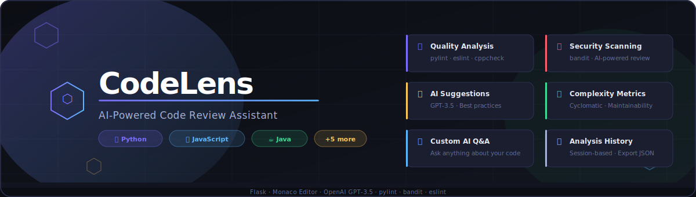

<div align="center">



<br /><br />

# ⬡ CodeLens — AI Code Review Assistant

**Static analysis + AI-powered suggestions + security scanning in one slick interface.**

[](https://python.org)
[](https://flask.palletsprojects.com)
[](https://openai.com)
[](https://microsoft.github.io/monaco-editor/)
[](SECURITY.md)

[Features](#-features) · [Demo](#-demo) · [Quick Start](#-quick-start) · [Usage](#-usage) · [API](#-api-reference) · [Contributing](#-contributing)

</div>

---

## ✨ Features

| Category | What you get |
|---|---|
| 🔍 **Quality Analysis** | `pylint` for Python · `eslint` for JS/TS · `checkstyle` for Java · `cppcheck` for C/C++ · `go vet` for Go |
| 🔒 **Security Scanning** | `bandit` for Python · AI-powered security review for all other languages |
| 💡 **AI Suggestions** | GPT-3.5-powered improvement tips: readability, performance, best practices |
| 📊 **Complexity Metrics** | Cyclomatic complexity estimate · Maintainability score · Plain-English summary |
| 🤖 **Custom AI Q&A** | Ask any question about your code — *"Why is this slow?"*, *"How do I add error handling?"* |
| 🕒 **Analysis History** | Last 20 analyses stored in-session; reload any previous result instantly |
| 📤 **Export** | Download full analysis results as JSON |
| ⌨️ **Power user UX** | Monaco editor with syntax highlighting · `Ctrl+Enter` to analyze · Dark/Light themes |

---

## 🎬 Demo

### Interface Overview

```
┌─────────────────────────────┬────────────────────────────────┐
│  Editor Panel               │  Results Panel                 │
│  ┌───────────────────────┐  │  ┌──────┬────────┬──────────┐  │
│  │  Monaco Editor        │  │  │Overv.│Quality │Security  │  │
│  │  (syntax highlight,   │  │  ├──────┴────────┴──────────┤  │
│  │   line numbers,       │  │  │  📊 Metric Cards         │  │
│  │   minimap)            │  │  │  🔍 Issue List           │  │
│  └───────────────────────┘  │  │  🔒 Security Alerts      │  │
│  Language ▾  Dark│Light     │  │  💡 AI Suggestions       │  │
│  [ Ask a question... ]      │  │  🤖 AI Response          │  │
│  [ ⬡ Analyze Code ]        │  └──────────────────────────┘  │
└─────────────────────────────┴────────────────────────────────┘
```

### Example: Python Code Analysis

**Input code:**
```python
def calculate_stats(numbers):
    total = 0
    for n in numbers:
        total = total + n
    average = total / len(numbers)   # ZeroDivisionError risk!
    return {"total": total, "average": average}
```

**Quality output (pylint):**
```
⚠ C0103: Variable name "n" doesn't conform to naming convention
⚠ W0611: Unused import detected
```

**Security output (bandit):**
```
✅ No security risks detected.
```

**AI Suggestions:**
```
1. Add a zero-length guard: if not numbers: return None (or raise ValueError)
2. Use sum(numbers) instead of a manual loop for readability
3. Add type hints: def calculate_stats(numbers: list[float]) -> dict
4. Consider returning None or raising ValueError on empty input
```

**Complexity:**
```
Overall: Low  |  Cyclomatic ≈ 2  |  Maintainability: 78/100
"Simple function with one potential edge case (empty list)."
```

---

## 🚀 Quick Start

### Prerequisites

| Tool | Version | Install |
|---|---|---|
| Python | 3.10+ | [python.org](https://python.org) |
| pip | latest | bundled with Python |
| OpenAI API key | — | [platform.openai.com](https://platform.openai.com/api-keys) |

### 1. Clone the repository

```bash
git clone https://github.com/YOUR_USERNAME/code-review-assistant.git
cd code-review-assistant
```

### 2. Set up the Python environment

```bash
# Create and activate a virtual environment (recommended)
python -m venv .venv
source .venv/bin/activate        # Windows: .venv\Scripts\activate

# Install dependencies
pip install -r backend/requirements.txt
```

### 3. Configure your API key

```bash
cp .env.example .env
# Open .env and set OPENAI_API_KEY=your-key-here
```

Or export it directly in your shell:

```bash
# macOS / Linux
export OPENAI_API_KEY="sk-..."

# Windows PowerShell
$env:OPENAI_API_KEY = "sk-..."
```

> 🔒 **Security:** The API key is read only from the environment. It is never stored in source code. See [SECURITY.md](SECURITY.md).

### 4. Start the backend

```bash
cd backend
python app.py
# → Running on http://127.0.0.1:5000
```

### 5. Open the frontend

Open `frontend/index.html` in your browser, or use **VS Code Live Server** (recommended, to avoid CORS issues).

---

## 📖 Usage

### Step-by-step walkthrough

1. **Write or paste code** into the Monaco editor on the left.
2. **Select the language** from the dropdown (`Python`, `JavaScript`, `Java`, etc.).
3. *(Optional)* **Type a custom question** in the prompt box — e.g., *"Is this function thread-safe?"*
4. Click **⬡ Analyze Code** or press **`Ctrl+Enter`**.
5. Browse results across the tabs on the right panel:
   - **Overview** — summary metrics at a glance
   - **Quality** — linter output with colour-coded severity
   - **Security** — vulnerability findings
   - **Suggestions** — numbered AI improvement tips
   - **AI Chat** — answer to your custom question

### Tips

- Switch between **Dark / Light** themes using the toggle in the toolbar.
- Click the **history tab** to reload any of your last 20 analyses.
- Use the **export button** (↓) to download results as JSON.
- Press **`Ctrl+Enter`** anywhere in the editor to trigger analysis.

---

## 🗂 Project Structure

```
code-review-assistant/
│
├── backend/
│   ├── app.py              # Flask REST API (rate limiting, validation, CORS)
│   ├── analysis.py         # Analysis engine (linters + AI calls)
│   └── requirements.txt    # Python dependencies
│
├── frontend/
│   ├── index.html          # Main UI (Monaco editor, tabs, results)
│   ├── style.css           # Dark IDE-inspired design system
│   └── app.js              # Frontend logic (fetch, render, history, export)
│
├── docs/
│   └── banner.png          # README banner image
│
├── .gitignore              # Excludes secrets, venvs, caches
├── CONTRIBUTING.md         # Dev setup & PR guidelines
├── SECURITY.md             # Security policy & responsible disclosure
└── README.md               # This file
```

---

## 🌐 API Reference

The backend exposes a simple REST API.

### `GET /health`

Returns server status and version.

```json
{ "status": "ok", "version": "2.0.0" }
```

### `GET /languages`

Returns supported language identifiers.

```json
{ "supported": ["python", "javascript", "typescript", "java", "c", "cpp", "go", "rust"] }
```

### `POST /analyze`

Analyze a code snippet.

**Request body:**
```json
{
  "code": "def foo(): pass",
  "language": "python",
  "prompt": "How can I improve this function?"
}
```

| Field | Type | Required | Notes |
|---|---|---|---|
| `code` | string | ✅ | Max 50,000 characters |
| `language` | string | ✅ | One of the supported languages |
| `prompt` | string | ❌ | Max 1,000 characters |

**Response:**
```json
{
  "quality":     ["⚠ C0103: Variable name 'n' doesn't conform…"],
  "security":    ["✅ No security risks detected."],
  "suggestions": ["Add type hints", "Handle empty input"],
  "complexity": {
    "overall": "Low",
    "cyclomatic": 2,
    "maintainability": 78,
    "summary": "Simple function with clear intent."
  },
  "custom_ai_response": "This function is not thread-safe because…",
  "language": "python",
  "lines": 5,
  "chars": 120
}
```

**Rate limits:** 10 requests/minute per IP · 100 requests/hour per IP

---

## ⚙️ Optional: Java Support (Checkstyle)

1. Download [Checkstyle](https://checkstyle.sourceforge.io/) and add it to your `PATH`.
2. Download a config (e.g., [Google Java Style](https://raw.githubusercontent.com/checkstyle/checkstyle/master/src/main/resources/google_checks.xml)) and place it at `/google_checks.xml` or update the path in `analysis.py`.

---

## 🔒 Security

- API keys are **never** stored in code — only read from environment variables.
- Rate limiting on all endpoints prevents abuse.
- All user-provided content is HTML-escaped before DOM insertion.
- Temp files used for linting are deleted immediately after use.
- See [SECURITY.md](SECURITY.md) for the full policy and vulnerability reporting instructions.

---

## 🤝 Contributing

Contributions are welcome! Please read [CONTRIBUTING.md](CONTRIBUTING.md) for guidelines.

---

<div align="center">
  <sub>Built with Flask, Monaco Editor, and OpenAI GPT-3.5</sub>
</div>
